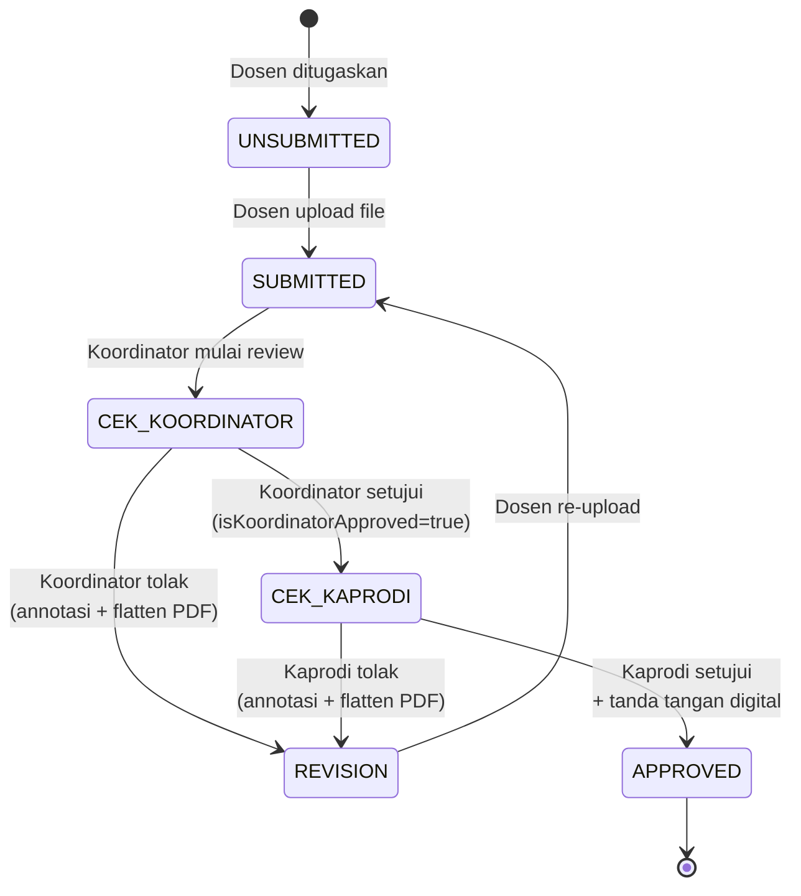
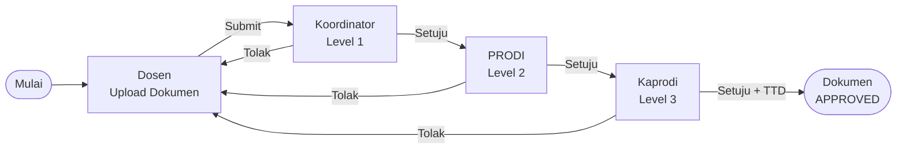
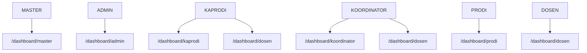
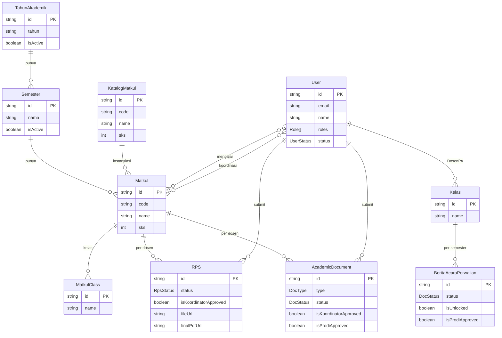
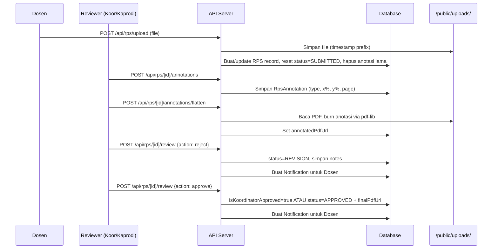

# Sistem Administrasi Prodi Informatika Medan


Portal administrasi akademik terpadu untuk Dosen dan Kaprodi — mendigitalisasi pengelolaan dokumen akademik (RPS, Soal UTS/UAS, LPP, EPP, Berita Acara) dengan alur kerja multi-level approval, anotasi PDF inline, dan tanda tangan digital.

---

## Fitur Utama

- **Multi-Role RBAC:** MASTER, ADMIN, KAPRODI, KOORDINATOR, DOSEN, PRODI — dengan account approval flow
- **8 Tipe Dokumen:** RPS, Soal UTS, Soal UAS, LPP, EPP, Berita Acara Perwalian
- **3-Stage Approval:** Koordinator → PRODI → Kaprodi dengan enforcement sekuensial
- **PDF Annotation:** Highlight, Draw, Box, Sticky Note langsung di browser; di-flatten ke PDF saat penolakan
- **Digital Signature:** Tanda tangan drag-and-drop pada PDF; tersimpan per-user sebagai template
- **Berita Acara Perwalian:** Per-kelas per-semester, 3 slot file, unlock oleh Kaprodi
- **Notifikasi Real-Time:** In-app toast queue + bell icon; polling 5 detik
- **Kaprodi Analytics:** Chart EPP, breakdown dokumen per tipe/status, filter per semester
- **DOCX → PDF:** Konversi otomatis via Gotenberg → LibreOffice → Puppeteer (fallback chain)
- **Manajemen Matkul:** Hierarki TahunAkademik → Semester → Matkul → Kelas; live catalog dari KatalogMatkul; sortable table columns
- **Katalog-Centric Hub:** Satu URL per katalog matkul menampilkan semua instansi semester; completion badge per matkul
- **Historical Data:** 441 dokumen historis (2022–2025) ter-import dan APPROVED; 42 KatalogMatkul dengan kode resmi UPH

---

## Tech Stack

| Layer | Technology |
|---|---|
| Framework | Next.js 16 (App Router), React 19 |
| Styling | Tailwind CSS 4 |
| ORM | Prisma 7 (`@prisma/adapter-pg`) |
| Database | PostgreSQL (Docker) |
| Data Fetching | SWR (5s polling) |
| PDF Processing | pdf-lib, PDF.js, react-pdf, Puppeteer, Mammoth |
| Charts | Recharts |
| Icons | Lucide React |

---

## Arsitektur Sistem

### Alur Approval Dokumen (State Machine)



### Alur Approval 3-Level (dengan PRODI)



### Struktur Role & Akses Dashboard



> KAPRODI, KOORDINATOR, dan DOSEN bisa digabung dalam satu akun.

### Skema Database (Relasi Utama)



### Alur Upload & Anotasi PDF



---

## Panduan Lokal (Development)

### Prerequisites

- Node.js v20+
- Docker Desktop

### Setup

```bash
# 1. Install dependencies
npm install

# 2. Copy environment file dan isi DATABASE_URL
cp .env.example .env

# 3. Start database container
docker compose up -d

# 4. Apply schema dan seed data
npx prisma migrate dev
npm run seed
npm run seed:katalog

# 5. Start dev server
npm run dev
```

Buka [http://localhost:3000](http://localhost:3000).

---

## Deployment (Local Server)

**Target:** Ubuntu 24.04 LTS · Node.js 22 LTS · PM2 · PostgreSQL via Docker

```bash
# 1. Clone dan install
git clone <repo> && cd <repo>
npm install

# 2. Konfigurasi environment
cp .env.example .env
# Edit .env — set DATABASE_URL

# 3. Start database
docker compose up -d

# 4. Migrasi dan seed
npx prisma migrate deploy
npm run seed
npm run seed:katalog

# 5. Build dan start
npm run build
pm2 start npm --name uph-admin -- start
pm2 save
pm2 startup   # ikuti instruksi untuk auto-start saat reboot
```

Akses via `http://<server-ip>:3000`. Opsional: konfigurasi Nginx sebagai reverse proxy di port 80.

> **MacBook sebagai server:** Tahan **Option** saat boot untuk pilih USB installer. Install Ubuntu 24.04 LTS headless. Gunakan Ethernet saat setup — WiFi Broadcom mungkin perlu `bcmwl-kernel-source`. Aktifkan OpenSSH saat install untuk remote management.

---

## Seed Accounts

| Email | Password | Role |
|---|---|---|
| master@test.com | master123 | MASTER |
| admin@test.com | admin123 | ADMIN |
| kaprodi@test.com | kaprodi123 | KAPRODI |
| koordinator@test.com | koordinator123 | KOORDINATOR |
| dosen@test.com | dosen123 | DOSEN |
| dosen2@test.com | dosen123 | DOSEN |
| prodi@test.com | prodi123 | DOSEN + PRODI |

---

## Useful Commands

```bash
npm run dev                   # Start dev server
npm run build                 # Production build
npm run lint                  # ESLint check
npm run seed                  # Seed test accounts
npm run seed:katalog          # Seed course catalog (KatalogMatkul)
npx prisma studio             # Prisma GUI
npx prisma migrate dev        # Run + create migrations
npx prisma generate           # Regenerate Prisma client
docker compose up -d          # Start Postgres
docker compose down           # Stop Postgres
```

---

## Known Limitations

- **Passwords plain text** — intentional for development; hash dengan bcrypt/argon2 sebelum produksi
- **No email notifications** — in-app only; Resend atau Gmail OAuth2 integration planned
- **No HTTPS enforcement** — acceptable untuk local LAN; required untuk internet-facing deployment
- **No automated backups** — setup PostgreSQL scheduled dumps sebelum go-live

---

## Dokumentasi

| File | Deskripsi |
|---|---|
| [docs/architecture.md](docs/architecture.md) | System design dan data flow |
| [docs/changelog.md](docs/changelog.md) | Full version history |
| [docs/project_status.md](docs/project_status.md) | Progress saat ini dan known issues |
| [docs/alur-sistem.md](docs/alur-sistem.md) | Panduan alur pengguna (Indonesian) |
| [docs/roadmap-active-semester.md](docs/roadmap-active-semester.md) | Planned: active semester auto-detection |
| [docs/roadmap-master-pages.md](docs/roadmap-master-pages.md) | Planned: Master account pages |
| [docs/roadmap-pwa-mobile.md](docs/roadmap-pwa-mobile.md) | Planned: PWA + mobile responsive |
| [docs/roadmap-dashboard-ux.md](docs/roadmap-dashboard-ux.md) | Planned: deferred dashboard UX features |

---

## Changelog Singkat

| Versi | Tanggal | Perubahan |
|---|---|---|
| **1.3.0** | 2026-04-30 | Collapsible sidebar, user menu dropdown, settings page, logout API |
| **1.2.1** | 2026-04-29 | Sortable table columns, delete TahunAkademik, login cleanup, bug fixes |
| **1.2.0** | 2026-04-29 | Katalog-centric hub, completion badges, accordion classes, kode resmi UPH |
| **1.1.0** | 2026-04-28 | Historical data import pipeline, 441 PDFs, 27 dosen seeded |
| **1.0.0** | 2026-04-25 | BAP workflow, full notification coverage, UI/UX overhaul |

---

## Versioning

Mengikuti [Semantic Versioning](https://semver.org/). Minor features → `0.x.0`; patches/fixes → `0.x.y`. Tidak naik ke `1.0.0` sampai siap rilis resmi.
