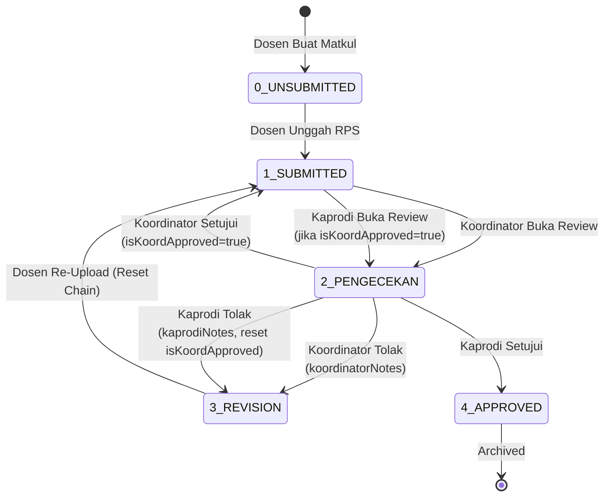

# Alur Sistem Kelola Rencana Pembelajaran Semester (RPS)

Dokumen ini menjelaskan secara rinci bagaimana ekosistem pengelolaan dokumen RPS beroperasi dengan alur persetujuan dua tingkat: **Dosen Pengampu** → **Koordinator** → **Kaprodi**.

---

## 1. Siklus Hidup Dokumen (Status Mappings)

Sistem menggunakan nilai `status` terpusat di Database yang ditambah flag `isKoordinatorApproved` untuk menentukan tahap persetujuan. Kombinasi keduanya menerjemahkan tampilan dan aksi untuk setiap peran:

| Status | `isKoordinatorApproved` | Tampilan Dosen | Tampilan Koordinator | Tampilan Kaprodi | Deskripsi |
| :--- | :--- | :--- | :--- | :--- | :--- |
| `0_UNSUBMITTED` | `false` | Belum Submit | (Tersembunyi) | (Tersembunyi) | Dosen baru mengeklaim matkul, belum unggah file. |
| `1_SUBMITTED` | `false` | Menunggu Koordinator | Needs Review | Menunggu Koordinator | File siap, menunggu verifikasi Koordinator. |
| `2_PENGECEKAN` | `false` | Pengecekan Koordinator | In Review | Menunggu Koordinator | Koordinator sedang membaca file. |
| `1_SUBMITTED` | `true` | Menunggu Kaprodi | Disetujui Koordinator | Needs Review | Koordinator setuju, sekarang tunggu Kaprodi. |
| `2_PENGECEKAN` | `true` | Pengecekan Kaprodi | Disetujui Koordinator | In Review | Kaprodi sedang membaca file. |
| `3_REVISION` | `false` \| `true` | Perlu Revisi | Revisi | Revisi | Ditolak Koordinator atau Kaprodi. Kembali ke Dosen. |
| `4_APPROVED` | `true` | Disetujui | Selesai | Selesai | Kaprodi menyetujui. Dokumen terkunci dan diarsipkan. |

---

## 2. Alur Kerja Aktor: Dosen

Dosen mengelola dokumen RPS mereka dengan inisiatif mandiri.

### A. Tahap Inisiasi (Pengeklaiman Tugas)
1. Dosen masuk ke dasbor **Kelola RPS**.
2. Sistem secara otomatis menampilkan semua Mata Kuliah yang ditugaskan kepada Dosen.
3. Status awal setiap matkul adalah `BELUM SUBMIT`.

### B. Tahap Eksekusi (Pengunggahan)
1. Dosen menekan tombol **"Unggah File"** pada baris matkul.
2. Dosen memilih file dokumen (PDF, DOC, DOCX) dari komputernya.
3. File berhasil diunggah. Status bergeser menjadi `SUBMITTED` (Menunggu Koordinator).
4. File sekarang terlihat oleh Koordinator dan Kaprodi secara bersamaan.

### C. Tahap Tanggapan (Jika Direvisi)
1. Jika dokumen ditolak (oleh Koordinator atau Kaprodi), status menjadi `REVISION`.
2. Dosen dapat melihat catatan revisi spesifik beserta nama reviewer yang menolak ("Ditolak oleh Koordinator" atau "Ditolak oleh Kaprodi").
3. Dosen memperbaiki dokumen dan menekan **"Re-Upload File"**.
4. Sistem reset rantai persetujuan: `isKoordinatorApproved = false`, status kembali `SUBMITTED`.
5. File kembali memasuki antrian Koordinator.

### D. Tahap Persetujuan (Jika Disetujui)
1. Ketika Kaprodi menyetujui, status berubah menjadi `APPROVED`.
2. Dosen melihat tombol ubah menjadi **"Download PDF"** (hijau, dapat diunduh).
3. Dokumen sekarang tersimpan dalam arsip akreditasi dan tidak dapat diubah lagi.

---

## 3. Alur Kerja Aktor: Koordinator

Koordinator adalah tier pertama persetujuan. Mereka hanya melihat dokumen dari matkul yang mereka koordinasi.

### A. Layar Antrian Utama (Tab: Needs Review)
1. Koordinator membuka dasbor **Kelola RPS**.
2. Tab "Needs Review" menampilkan semua dokumen `SUBMITTED` dengan `isKoordinatorApproved = false`.
3. Setiap baris menampilkan: Mata Kuliah, Dosen Pengampu, Status, dan tombol **"Review Dokumen"**.

### B. Proses Review Dokumen
1. Koordinator menekan **"Review Dokumen"**, membuka modal dialog besar.
2. Koordinator dapat mengunduh file untuk diperiksa.
3. Koordinator memiliki dua aksi mutlak:
   - **Setujui Dokumen**: `isKoordinatorApproved = true`, `status = SUBMITTED` (belum selesai—Kaprodi masih harus melihat).
   - **Tolak & Kembalikan**: `status = REVISION`, `koordinatorNotes = catatan revisi`.

### C. Pemantauan Revisi (Tab: Menunggu Revisi)
1. Dokumentasi yang ditolak oleh Koordinator muncul di tab "Menunggu Revisi".
2. Setiap baris menampilkan nama Mata Kuliah, Dosen, dan catatan revisi dengan label **"Ditolak oleh Koordinator"**.
3. Koordinator dapat mengirim pengingat kepada Dosen.

### D. Direktori Dosen (Tab: Direktori Dosen)
1. Koordinator dapat melihat ringkasan progress setiap Dosen.
2. Sistem menampilkan persentase dokumen yang telah selesai vs total.

### E. Arsip Terverifikasi (Tab: Arsip Terverifikasi)
1. Dokumen yang telah disetujui Kaprodi (status `APPROVED`) muncul di sini.
2. Koordinator dapat mengunduh versi final.

---

## 4. Alur Kerja Aktor: Kaprodi

Kaprodi adalah tier kedua dan final persetujuan. Mereka melihat **semua** dokumen di sistem, tidak hanya yang berada di matkul mereka.

### A. Layar Antrian Utama (Tab: Needs Review)
1. Kaprodi membuka dasbor **Evaluasi RPS**.
2. Tab "Needs Review" menampilkan semua dokumen `SUBMITTED` dengan `isKoordinatorApproved = true`.
3. Setiap baris menampilkan: Mata Kuliah, Dosen, **Koordinator (yang menyetujui)**, Status, dan tombol aksi.
4. Dokumen yang belum disetujui Koordinator (`isKoordinatorApproved = false`) muncul di tabel tetapi dengan **tombol Review Dokumen DISABLED** (terkunci dengan label "Menunggu Koordinator").

### B. Proses Review Dokumen
1. Kaprodi hanya dapat membuka dialog review jika Koordinator telah menyetujui.
2. Kaprodi mengunduh file dan membaca dengan teliti.
3. Kaprodi memiliki dua aksi:
   - **Setujui Dokumen**: `status = APPROVED` (dokumen final dan diarsipkan).
   - **Tolak & Kembalikan**: `status = REVISION`, `isKoordinatorApproved = false`, `kaprodiNotes = catatan revisi`.

### C. Pemantauan Revisi (Tab: Menunggu Revisi)
1. Dokumentasi yang ditolak oleh Kaprodi muncul di sini.
2. Catatan revisi menampilkan label **"Ditolak oleh Kaprodi"** untuk kejelasan.
3. Kaprodi dapat mengirim pengingat.

### D. Direktori Dosen (Tab: Direktori Dosen)
1. Kaprodi melihat ringkasan progress keseluruhan semua Dosen di program studi.
2. Persentase penyelesaian diakumulasikan per Dosen.

### E. Arsip Terverifikasi (Tab: Arsip Terverifikasi)
1. Dokumen yang telah disetujui Kaprodi (status `APPROVED`) ditampilkan di sini.
2. Kaprodi dapat mengunduh dan menyimpan untuk akreditasi.

---

## 5. Aturan Teknis Backend

### Upload File (Dosen)
- Endpoint: `POST /api/rps/upload`
- Ketika Dosen unggah atau re-upload:
  - Jika RPS baru: buat dengan `status = SUBMITTED`, `isKoordinatorApproved = false`
  - Jika RPS sudah ada (re-upload): reset approvals, set `isKoordinatorApproved = false`, `status = SUBMITTED`, null semua notes

### Review (Koordinator atau Kaprodi)
- Endpoint: `PATCH /api/rps/[id]/review`
- Body: `{ reviewer: 'koordinator' | 'kaprodi', action: 'approve' | 'reject', notes?: string }`

**Koordinator Approve:**
```
isKoordinatorApproved = true
koordinatorId = current user
status = SUBMITTED (tidak berubah—tetap di antrian Kaprodi)
koordinatorNotes = null
```

**Koordinator Reject:**
```
status = REVISION
isKoordinatorApproved = false
koordinatorNotes = notes dari Koordinator
kaprodiNotes = null (reset jika ada)
```

**Kaprodi Approve:**
```
status = APPROVED (final)
isKoordinatorApproved tetap true
```

**Kaprodi Reject:**
```
status = REVISION
isKoordinatorApproved = false (reset chain)
kaprodiNotes = notes dari Kaprodi
koordinatorNotes tetap (untuk referensi)
```

---

## 6. Diagram Status (Mermaid)



---

## 7. UI Consistency (Koordinator & Kaprodi)

Kedua dasbor (Koordinator dan Kaprodi) menggunakan UI identik:
- Layout Tab: Needs Review, Menunggu Revisi, Direktori Dosen, Arsip Terverifikasi
- Tabel: Kolom Mata Kuliah, Dosen, Status, Aksi
- Modal Review: Identik (hanya button text yang kontekstual)
- Badge Status: "Needs Review", "In Review", "Revisi", "Selesai", dst.
- Warna & Spacing: Sepenuhnya konsisten

Perbedaan logika saja:
- **Koordinator** melihat dokumen dari matkul mereka saja.
- **Kaprodi** melihat semua dokumen dan dapat melihat nama Koordinator di kolom.
- **Kaprodi** tombol review terkunci sampai Koordinator menyetujui.

---

## 8. Testing Checklist

- [ ] Dosen unggah file → terlihat di Koordinator dan Kaprodi
- [ ] Koordinator approve → file tetap di SUBMITTED, Kaprodi bisa review
- [ ] Koordinator reject → Dosen lihat revisi, re-upload reset chain
- [ ] Kaprodi approve → status APPROVED, Dosen lihat Download
- [ ] Kaprodi reject sebelum Koordinator approve → tidak bisa (tombol disabled)
- [ ] Revisi notes menampilkan "Ditolak oleh Koordinator" atau "Ditolak oleh Kaprodi"
- [ ] Dosen download PDF hanya saat APPROVED
- [ ] Progress bar akurat di Direktori Dosen
