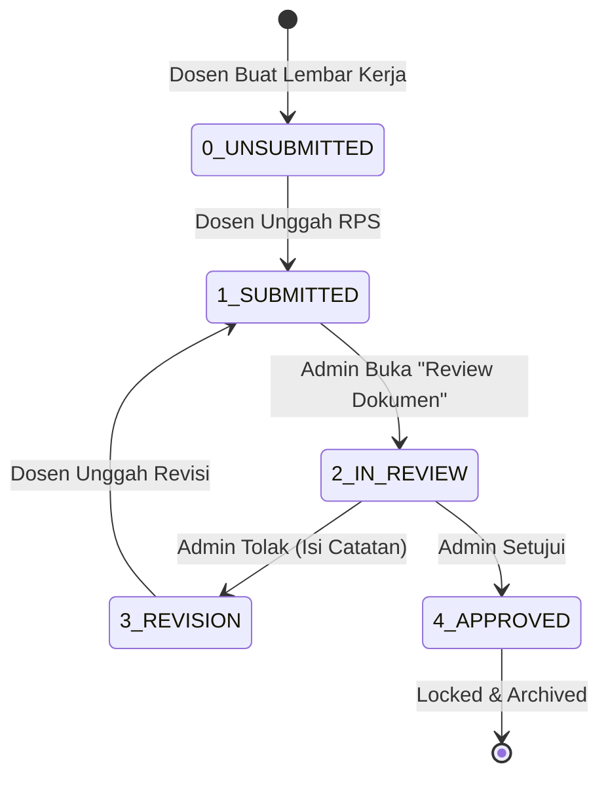

# Alur Sistem Kelola Rencana Pembelajaran Semester (RPS)

Dokumen ini menjelaskan secara rinci bagaimana ekosistem pengelolaan dokumen RPS beroperasi di antara dua aktor utama: **Dosen Pengampu** dan **Admin/Kaprodi**.

---

## 1. Siklus Hidup Dokumen (Status Mappings)

Agar Dosen dan Admin memahami apa yang sedang terjadi tanpa kebingungan terminologi, sistem menggunakan satu nilai terpusat di _Database_, yang diterjemahkan ke bahasa antarmuka masing-masing:

| Database Status | Tampilan Dosen | Tampilan Admin | Deskripsi Skenario (Aksi) |
| :--- | :--- | :--- | :--- |
| `0_UNSUBMITTED` | ⚪ Belum Submit | ⚪ WAITING | Dosen baru saja mengeklaim Mata Kuliah, namun belum ada file yang diunggah. |
| `1_SUBMITTED` | 🔵 Submitted | 🔴 NEEDS REVIEW | Dosen berhasil mengunggah PDF/Word. Masuk antrean tunggu konfirmasi Admin. |
| `2_IN_REVIEW` | 🟡 Pengecekan | 🟡 IN REVIEW | Admin mengklik "Review Dokumen" dan sedang membaca file. Dosen tidak bisa melakukan apa pun. |
| `3_REVISION` | 🟠 Ditolak / Revisi | ⏳ WAITING REV. | Admin selesai mereview dan menemukan kesalahan spesifik. Admin menulis "Catatan Revisi" dan mengembalikan tugas ke Dosen. |
| `4_APPROVED` | 🟢 Disetujui | 🟢 COMPLETED | Admin menyetujui dokumen. Dokumen terkunci dan masuk ke dalam arsip akreditasi. |

---

## 2. Alur Kerja Aktor: Dosen

Tugas Dosen sangat berbasis inisiatif mandiri untuk mengurangi beban operasional tata usaha. Alur kerja Dosen adalah sebagai berikut:

### A. Tahap Inisiasi (Pengeklaiman Tugas)
1. Dosen masuk ke dasbor **Kelola RPS**.
2. Dosen menggunakan fitur *Autocomplete Search* untuk mencari **Mata Kuliah** yang ia ampu.
3. Dosen memasukkan keterangan ekstra (contoh: *Semester Genap*, *Tahun Ajaran 2025/2026*).
4. Dosen menekan **"Buat Form"**. Secara langsung, sistem membuat sebuah baris "lembar kerja" kosong berstatus `BELUM SUBMIT` di dalam tabel pribadinya.

### B. Tahap Eksekusi (Pengunggahan)
1. Dosen menekan tombol **"Unggah File"** pada baris lembar kerjanya secara langsung.
2. Dosen memilih *File Document* dari komputernya.
3. Status otomatis beralih menjadi `SUBMITTED`. Mulai dari sini, bola berada di tangan Admin.

### C. Tahap Tanggapan (Jika Direvisi)
1. Jika dokumen mengalami *re-work* (ditolak Admin), Dosen akan melihat barisnya berubah warna merah dengan keterangan teguran spesifik (contoh: *"Kriteria Evaluasi tidak jelas"*).
2. Dosen memperbaiki dokumen di komputernya.
3. Dosen mengklik tombol **"Re-Upload File"** untuk mengirimkan salinan terbaru. Transisi status kembali melingkar ke `SUBMITTED`.

---

## 3. Alur Kerja Aktor: Admin (Kaprodi)

Antarmuka Admin sepenuhnya dikhususkan untuk kelincahan *(agility)* dan menggunakan desain berorientasi penyelesaian pekerjaan (*Action-Oriented Tabs*).

### A. Layar Antrean Utama (Tab 1: Needs Review)
1. Saat Admin / Kaprodi meninjau dasbor, ia hanya disambut oleh dokumen yang butuh perhatian prioritas (Status: `1_SUBMITTED`).
2. Kaprodi menekan tombol **"Review Dokumen"**, memicu sebuah *Pop-out Dialog* besar (merubah status database ke `2_IN_REVIEW`).
3. Di dalam dialog, Kaprodi mengunduh (*Download*) file PDF yang disematkan Dosen untuk diperiksa.

### B. Proses Kualitas Cek (Di Dalam Modal Review)
Setelah mengunduh dan membaca, Admin punya **Dua Pilihan Mutlak**:
*   **Jika Salah (Tolak & Kembalikan):** Admin wajib mengetik teguran perbaikan di dalam  *TextArea* "Catatan Revisi". Status bergeser ke `3_REVISION` (Masuk ke Tab 2).
*   **Jika Benar (Setujui Dokumen):** Status secara permanen bergeser ke `4_APPROVED` (Dokumen hilang dari layar prioritas dan berpindah masuk ke Tab Arsip).

### C. Pemantauan & Eskalasi (Tab 2: Menunggu Revisi)
Admin dapat mengawasi dokumen-dokumen yang sedang nyangkut di tangan Dosen (status `3_REVISION`). Jika Dosen terlihat terlalu lama memperbaikinya, Admin dapat menekan tombol **"Kirim Pengingat"** (Ping *email/WhatsApp* institusi).

### D. Penilaian Integritas Direktori (Tab 3: Rekap Dosen)
Jika Kaprodi ingin tahu _"Berapa presentase keseluruhan beban kerja Bapak Budi yang sudah kelar?"_, Admin beralih ke Tab Direktori Dosen. Sistem mengakumulasikan seluruh lembar kerja tersebut menjadi Bar Persentase.

---

## 4. Diagram Status

