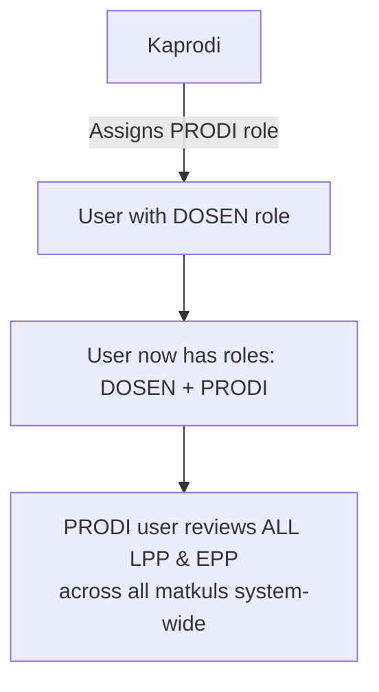
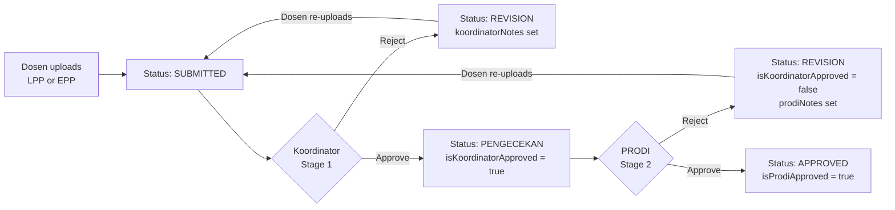
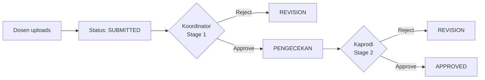

# Plan: PRODI Role + LPP/EPP Workflow

## Summary

Add a new `PRODI` role to handle Stage 2 review of **LPP** and **EPP** documents.  
**Kaprodi** assigns the PRODI role to eligible users (must already be DOSEN).  
Once assigned PRODI role, the user reviews **all** LPP & EPP across all matkuls — no per-matkul scoping.

---

## Role & Assignment Flowchart



### Who assigns what

| Action | Who can do it | Constraint |
|--------|--------------|------------|
| Assign `PRODI` role to a user | **Kaprodi** only | Target user must already have `DOSEN` role |
| Remove `PRODI` role from a user | **Kaprodi** only | — |

> PRODI is **not** matkul-scoped. One PRODI user sees all LPP/EPP from every matkul.

---

## Document Approval Workflow

### LPP / EPP — New 2-stage flow



### All other documents (RPS, SOAL_UTS, SOAL_UAS, etc.) — unchanged



---

## Schema Changes

### 1. `Role` enum — add `PRODI`

```prisma
enum Role {
  MASTER
  ADMIN
  KAPRODI
  KOORDINATOR
  DOSEN
  PRODI
}
```

### 2. `User` model — add back-relation

```prisma
prodiDocReviews  AcademicDocument[] @relation("ProdiAcademicReview")
```

### 3. `AcademicDocument` model — add PRODI review fields

```prisma
isProdiApproved  Boolean  @default(false)
prodiId          String?
prodi            User?    @relation("ProdiAcademicReview", fields: [prodiId], references: [id])
prodiNotes       String?
```

---

## API Changes

### `PATCH /api/users/[id]/role`

Caller with `KAPRODI` role (non-MASTER) can:
- Only add/remove `PRODI` role on the target
- Target must already have `DOSEN` role
- Cannot strip `DOSEN` while assigning `PRODI`

### `PATCH /api/documents/[docId]/review`

Add `reviewer === 'prodi'` branch for `LPP`/`EPP` doc types:
- Guard: `isKoordinatorApproved` must be `true`
- `approve` → `{ isProdiApproved: true, prodiId, status: 'APPROVED' }`
- `reject`  → `{ status: 'REVISION', isProdiApproved: false, isKoordinatorApproved: false, prodiNotes: notes }`

---

## Routing

```
PRODI → /dashboard/prodi  (+ /dashboard/dosen)
```

PRODI is added to the combinable-roles group in `dashboard/layout.tsx`.

---

## New Dashboard Pages

### `src/app/dashboard/prodi/`

```
prodi/
  page.tsx    → PRODI dashboard with LPP+EPP queue stats
```

Query: all `AcademicDocument` where `type IN [LPP, EPP]`, `isKoordinatorApproved = true`, `isProdiApproved = false`.

### Kaprodi dashboard

- Existing users page gets PRODI toggle for DOSEN users (new section in role edit modal, KAPRODI-only)

---

## Seed

New test account: `prodi@test.com` / `prodi123` with roles `[DOSEN, PRODI]`.

---

## Build Sequence (completed)

| Step | File | Status |
|------|------|--------|
| 1 | `prisma/schema.prisma` | ✅ |
| 2 | `npx prisma migrate dev` | ✅ |
| 3 | `src/app/api/users/[id]/role/route.ts` | ✅ |
| 4 | `src/app/api/documents/[docId]/review/route.ts` | ✅ |
| 5 | `src/app/dashboard/layout.tsx` | ✅ |
| 6 | `src/app/dashboard/prodi/page.tsx` | ✅ |
| 7 | `src/app/page.tsx` (login redirect) | ✅ |
| 8 | `prisma/seed.ts` | ✅ |
